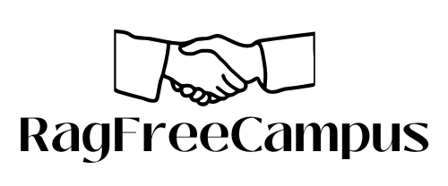

# RagfreeCampus

This Platform Main Mission is to eradicate & Solve the problem of Ragging From Eductation Institution by Providing a Teacher & Student Communictation System

# Tech Stacks Used:-

<ul>
<li> </li>

<li>  </li>

</ul>

# Authentictation System

From Login Form We are checking if the user already has a Account or Not via FireBase, If they don't have they are given option to the Sign-up Page to Create a Account
where Using FireBase We Store the Data, Seperate Accounts are Created for the Teacher & Student, After Succesful Login ,Students are Redirected to the Student DashBoard & Teachers Are Redirected to the Teacher DashBoard

# Complaint System

In Student DashBoard, Students Files a Complaint & can Upload Various Media File to Suppourt their Complaint, They Can Also See the Status of their Complaint Active or Resolved  
 
In Teacher Dashboard, Teacher Receives the complaint & on thier Side they can see the Media Files recieved in the Complaint, they can also see the the status of the complaint they recieved, after the complaint is resolved they can change the status of the complaint

 

Students then on their dashboard can see the Updated Status

# Team Member:-
<ol>
 <li> Afeef Uddin (Team Leader)</li>
 <li>Aftab Alam</li>
 <li>Subhrajit Hazra</li>
<li> Shinjan Saha</li>
</ol>

# Github Account:-
 algovengers
